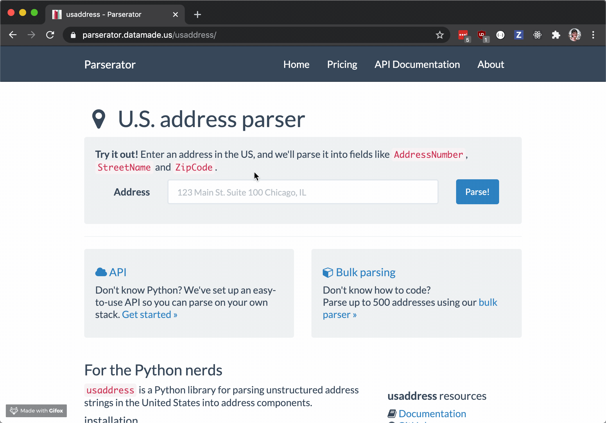

# DataMade Code Challenge: Parserator

Welcome to the DataMade code challenge! 👋

Your task is to recreate the **address parsing form** in DataMade's
[Parserator](https://parserator.datamade.us) web service. Parserator can take
input strings that represent addresses (like `123 main st chicago il`)
and split them up into their component parts:



In this repo, we've provided the basic scaffolding of the templates, views, and
routes that comprise the app. You'll need to flesh out certain code blocks in
the frontend and backend code in order to send API requests, process them on
the server, and display the results to the user.

You can use vanilla JavaScript or jQuery to complete the JavaScript portions of
this assessment.

To get started, fork this repo and follow the instructions below.

## Installation

Development requires a local installation of [Docker](https://docs.docker.com/install/)
and [Docker Compose](https://docs.docker.com/compose/install/). These are the
only two system-level dependencies you should need.

Once you have Docker and Docker Compose installed, build the application containers:

```
docker-compose build
```

Next, run the app:

```
docker-compose up
```

The app will log to the console, and you should be able to visit it at http://localhost:8000.

## Completing the challenge

Once you have the app up and running on your computer, you'll need to flesh out
certain code blocks to complete the parsing interface.

**Note:** You can use the following address strings for testing during implementation:

- ✅ Valid: `123 main st chicago il`
- ❌ Invalid: `123 main st chicago il 123 main st`

### Step 1: Implement the `parse` method

In `parserator_web/views.py`, use [`usaddress`](https://github.com/datamade/usaddress)
to implement the `AddressParse.parse()` method. It should return two pieces of
data:

- `address_components`: The parsed address
- `address_type`: The type of address provided

### Step 2: Complete the API endpoint

In `parserator_web/views.py`, complete the `AddressParse.get()` method to return
three pieces of data:

- `input_string`: The string that the user sent
- `address_components`: A dictionary of parsed components that comprise the address,
   in the format `{address_part: tag}` (returned by `AddressParse.parse()`)
- `address_type`: A string representing type of the parsed address (returned by `AddressParse.parse()`)

Don't forget to handle strings that cannot be parsed and return errors!

### Step 3: Wire up the form to send requests to the API

In `parserator_web/templates/parserator_web/index.html`, fill out the `<script>`
tag in the `extra_js` block, adding JavaScript code that will use the form
to send form data to the API endpoint fleshed out in Step 2.

### Step 4: Display results from the API

In `parserator_web/templates/parserator_web/index.html`, extend the `<script>`
tag in the `extra_js` block to display results from the API endpoint in the
hidden element `<div id="address-results">`.

Make sure that if the API raises an error, it displays this error to the user.

### Step 5: Add unit tests

The `tests/` directory contains two stubbed tests. Complete each test by making
a request to the API endpoint and verifying that it passes or fails, and
returns the expected output.

You can run the tests using Docker:

```bash
docker-compose -f docker-compose.yml -f tests/docker-compose.yml run --rm app
```

Not familiar with `pytest`? Consult [our testing guidelines](https://github.com/datamade/testing-guidelines)
for quick start instructions, plus tips and tricks for testing Django
applications.

### Step 6: Submit your work

To submit your work, create a feature branch for your code, commit your changes,
push your commits up to your fork, and open up a pull request against `master`.
Finally, drop a link to your pull request in your application.
